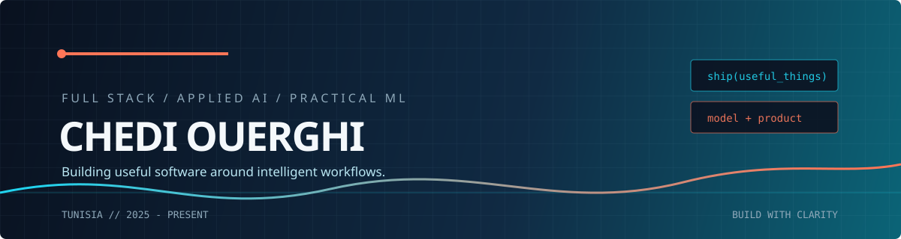

  
  
  

 

## I build the layer between an idea and a useful product.

I am a **Full Stack Developer** working across backend systems, modern web interfaces, applied AI, and practical machine learning. I integrate models where they improve a real workflow, then build the APIs, data flows, interfaces, and automation around them.

I am not trying to make every product sound like research. My strength is turning a technical capability into something structured, testable, and usable.

> **The rule I build by:** start with the workflow, choose the simplest intelligent solution, and make the surrounding software dependable.

## What I bring

<table>
<tr>
<td width="33%" valign="top">

### 01 / Product systems

Full stack features that feel coherent from the first click to the database.

`React` `Next.js` `TypeScript` `NestJS`

</td>
<td width="33%" valign="top">

### 02 / Applied intelligence

Model integrations, NLP workflows, CV parsing, assistants, and automation with a clear product purpose.

`Python` `FastAPI` `NLP` `AI APIs`

</td>
<td width="33%" valign="top">

### 03 / Reliable foundations

Auth, roles, real-time communication, async processing, testing, containers, and deployable APIs.

`PostgreSQL` `Redis` `Docker` `CI/CD`

</td>
</tr>
</table>

## Selected builds

<table>
<tr>
<th align="left">Build</th>
<th align="left">What it proves</th>
<th align="left">Core stack</th>
</tr>
<tr>
<td><strong>CV-to-job matching</strong> Applied AI / ML</td>
<td>CV parsing and profile matching delivered through asynchronous APIs and an administration dashboard.</td>
<td><code>FastAPI</code> <code>PostgreSQL</code> <code>NLP</code></td>
</tr>
<tr>
<td><strong>VitaMind</strong> AI product</td>
<td>Emotional analysis, an AI assistant, psychologist tooling, and patient management in one product system.</td>
<td><code>FastAPI</code> <code>NestJS</code> <code>Next.js</code></td>
</tr>
<tr>
<td><strong>Padel platform</strong> Booking system</td>
<td>Role-based access, booking flows, match scheduling, notifications, tests, and Docker deployment.</td>
<td><code>NestJS</code> <code>Prisma</code> <code>PostgreSQL</code></td>
</tr>
<tr>
<td><strong>Communication platform</strong> Real-time systems</td>
<td>Messaging, voice and video calls, presence, typing indicators, read receipts, and Redis-backed events.</td>
<td><code>WebSockets</code> <code>Redis</code> <code>Node.js</code></td>
</tr>
</table>

## Experience

| Role | Scope |
| :--- | :--- |
| **Full Stack Developer Intern · Elepzia** March 2025 - August 2025 | NestJS and PostgreSQL services, Next.js administration, authentication, RBAC, KYC, REST APIs, real-time communication, Docker, and CI/CD. |
| **Backend & Machine Learning Developer · Sagemcom** August 2025 - September 2025 | FastAPI and PostgreSQL APIs, NLP-based CV parsing, asynchronous processing, CV-to-job matching, and React administration features. |

## Toolbox

## GitHub signal

  

  

Contribution rhythm, generated automatically from GitHub activity.

 

<picture>
  <source media="(prefers-color-scheme: dark)" srcset="https://raw.githubusercontent.com/chedi-ouerghi/chedi-ouerghi/output/github-contribution-grid-snake-dark.svg" />
  
</picture>

## Let's make something useful

Open to conversations about full stack products, backend architecture, applied AI, practical machine learning, and automation.

**[Portfolio](https://chedi-portfolio-2026.vercel.app/) · [LinkedIn](https://www.linkedin.com/in/chedi-ouerghi-21860a24a/) · [Email](mailto:chediouerghi40@gmail.com)**

